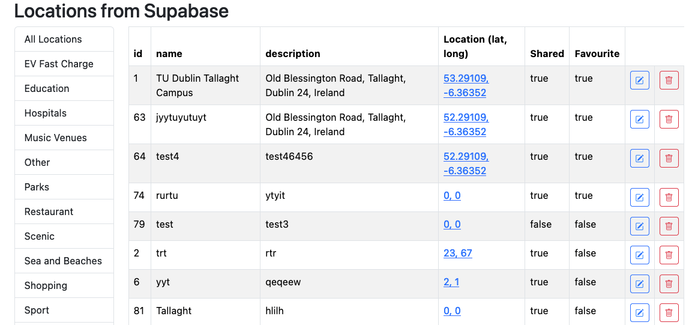
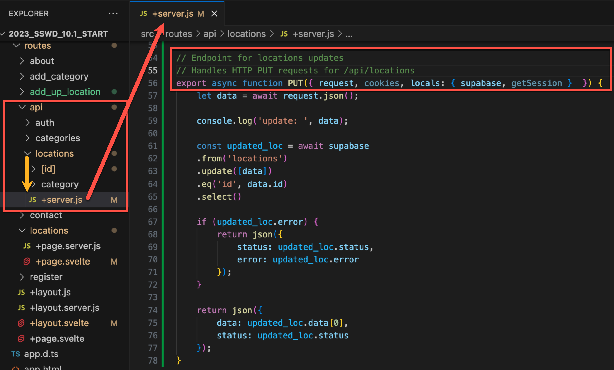
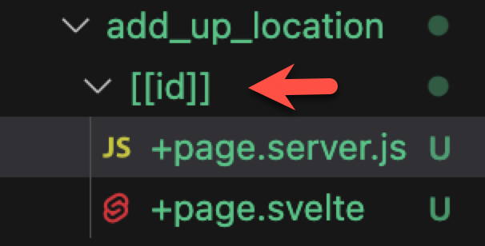
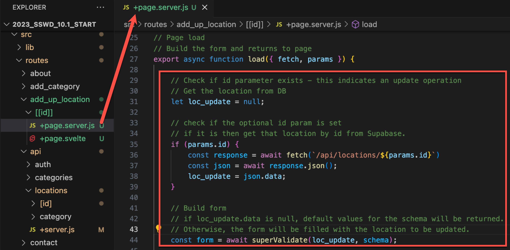
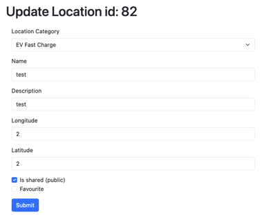
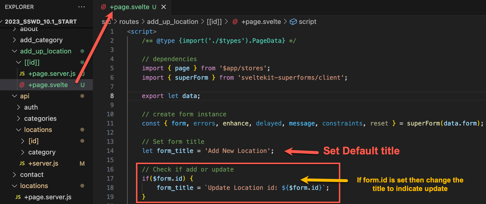
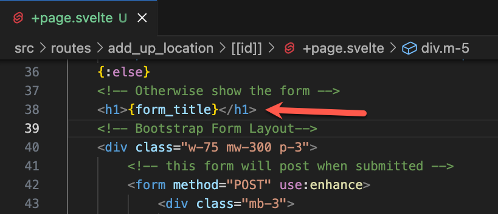

# Lab 10 - Update and Delete

Enda Lee 2023

### Quick Start

1. Download the start site from this repository and extract it to a folder named `lab10`.
2. Open the `lab10` **folder** in VS Code.
3. In a terminal run `npm install`.
4. Start the application using `npm run dev`.

This repository includes solution to the previous lab exercises. 

**You will need to add `.env` (base it on `.env.example`) and set your API keys, etc.**


## Introduction

This lab completes the `CRUD` functionality in the site by adding `Update` and `Delete`. 




## 1. API Endpoints

Following the previous examples, API endpoints will be used to access Supabase.


Add the `PUT` function, which will handle updates, after the existing `POST` function in **`/src/routes/api/locations/+server.js`**



The function is very similiar to the insert/ POST function but the  `.update` and `.eq` lines in the supabase query.

```javascript
    const updated_loc = await supabase
    .from('locations')
    .update([data])
    .eq('id', data.id)
    .select();
```

In order for the update to work, he product data must include an `id`. This is unlike the `insert` which does not have an `id`.


## 2. Using a form to update

Adding a new page/ route and form is one option. However, as `insert` and `update` are very similiar, it makes more sense to update the existing `add_location` form.

The main difference between inserting and updating a location is the `id` value which is required for updating but not for insert.

### 2.1. Rename the route and add a optional `[[id]]` parameter

1. First, rename the `add_location` route to `add_up_location`. 

2. Then add the optional  `[[id]]` parameter folder. The double square brackets are used to mark the value as optional.
3. Finally, move the two files into the `[[id]]` folder.



 

### 2.2. Decide whether to insert or update

This will happen in the server `load()` function, open `+page.server.js` for editing.

The boxed code checks for `param.id`.

1. If it exists then it is fetched from Supabase and used to fill out the form for update.
2. If not then an empty form is generated for adding a new location (like before) .




### 2.3. Changes to `+page.svelte` and the form

The form must be updated to indicate insert or update. The figure show an example of the form filled for update.




1. First declare a new variable `form_title` and set it to the default for title (add new location).

2. Then check for `$form.id`. If it exists set the update title.

## 


3. Display the title on the page, above the form (replacing the existing text):

   


4. Add the location `id` value to the form as a hidden field. This value is not editable but still needs to be submitted with the form. Adding it as a hidden field will allow this. Add it just before the submit button and make sure that the `name` property is set to `id`.

   


**Exercise:** Try the updated form by opening the add location page. Pass an id parameter to update.


### 2.4 Update the form action

At this point a location can be selected for update but submitting the form will still insert a new location. The form action, in `+page.server.js` must be updated to handle updates. 

This workes by changing the `HTTP method` in the API call, `POST` will insert, `PUT` will update.

1. Declare a variable, `http_method` and initialise its value to `POST`. 
2. Check for `form.id`, if it exists set `http_method = 'PUT'`.
3. Modify the `fetch` API call so that it sets `method: http_method`.
4. This will switch between Insert and Update depending on `form.id`. 


**Exercise:** Tesp insert and update again.


## 3. Add update buttons to the locations page

This will allow locations to be updated easily. The finished page will look like this:

 


The button should be added in a new table column `<td></td>` afer the existing columns. 

When clicked the button should open the `/add_up_location/id` route, with the current location id value as a parameter.


## 5. Exercises

1. Add the required Auth policies to allow updates to the locations table in Supabase.
2. Get the Delete button working and set the required Auth policies.
3. Only show update ad delete buttons if a user is logged in.
4. Modify the locations page to only show update and delete buttons for locations belonging to the logged in user. 
5. Protect the routes and API endpoints from unauthorised access. See the add locations enpoint for an example.


------

Enda Lee 2023
